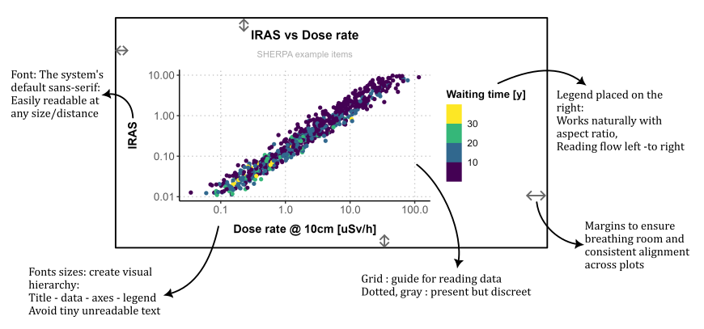

## Introduction

### Purpose of this package

This package aims towards a **consistent visual standard** for all figures produced by the team.

The goal is that any plot created with this package is:

- Immediately understandable without visual clutter
- Focused on the data, not on decoration
- Readable from a distance (presentations, conferences, large screens)
- Safe to print and embed in reports without quality loss
- Consistent across people, projects, and time

---

### General Visual Philosophy

First comes the info and then comes the art.
The data must be the most visible element in the figure.
Everything else (grid, text, legend, colors, margins) exists to support readability.

In order to apply the above, a custom theme was developed. Its main points are visualised below:

---



---

#### Color Philosophy

Color is never used decoratively — only to encode information.

- **For 3 or more colors**: Viridis palette
    - Perceptually uniform
    - Colorblind-safe
    - Professional and calm tones
    - Good contrast on white background

- **For 2 colors only**: cadetblue & coral
    - In this exceptional case, viridis is not used as its first two colors (purple and yellow) provide poor contrast on white when used alone. This custom pair ensures immediate visual distinction without harsh contrast.

---

## How to use

### Load/install

For both cases you will need the package "devtools". Install with `install.packages("devtools")`

- If you want to **install**: In an R console (in RStudio or Positron or VSCode with R extension, whatever you prefer) go to the root directory and do `devtools::install()`. This will send the package to wherever your R installs packages in your system and if the package changes you'll have to re-install. When you want to use the package, simple do `library(RoViz)`. You don't even need any of the files anymore.

- If you want to **load**: In an R console (in RStudio or Positron or VSCode with R extension, whatever you prefer) go to the root directory and do `devtools::load_all()`. This time, the package will be visible normally in your R session but it's not installed on your computer. If you want to use it again in a different session you'll have to load it again. You can't use it without the whole folder structure.

Which of the two should I do? 
Well, for reproducibility reasons, it's better if you pull the version of the package available when you're doing your study, have all the scripts in your study folder, load the package to work with it and later archive together with the rest of the study. In this way, if anyone needs to re-run in the future, everything will be working properly. 

### How to apply the theme 

Two options:

- In the beginning of your script do `theme_see(theme_professional())`
- Add ` + theme_professional()` to your every plot

### How to export your plots

In order for all plots to be consistent in terms of sizing and quality, a function to export is provided. To use it for saving a simple plot named `plot` that has a legend do:

`save_plot(plot,rows=1,columns=1,legend="y",filename="plot.png")`

You can use the same function to save any kind of plot, if for example you have a large composite plot that consists of 4 subplots arranged in 2x2, just change rows=2 and columns=2.

By using this function, the aspect ratio is ensured to be 1:1.4 (so that the plot is slightly longer than it is high, it tends to be easier to understand) and if a legend exists it is offsetted a little to make breathing space for it. Furthermore, the absolute size of all similar plots is the same and the resolution is forced to 300 dpi so that no pixelization occurs when projected on large screens.

---

## Available plots

```{r setup, include=FALSE}
devtools::load_all()
library(ggplot2)
theme_set(theme_professional())
df <- read.csv("Files_for_guide/items_TFA_sherpa_2025_a_itm.csv")
```

### Material composition

```{r pmat, fig.width=3*5, fig.height=2*5/1.4, dpi=96}
plot_materials(df)
```

### Irradiation parameters

```{r pirr, fig.width=3*5, fig.height=1*5/1.4, dpi=96}
plot_irradiation(df)
```

### Physical characteristics

```{r pmass, fig.width=3*5, fig.height=1*5/1.4, dpi=96}
plot_mass_info(df)
```

### Machine of origin

```{r pmach, fig.width=2*5, fig.height=1*5/1.4, dpi=96}
plot_machine(df)
```

### Experimental values

```{r pmeas, fig.width=2*5, fig.height=1*5/1.4, dpi=96}
plot_measures(df)
```

### Characterisation quantities

```{r pchar, fig.width=2*5, fig.height=1*5/1.4, dpi=96}
plot_char_quantities(df)
```